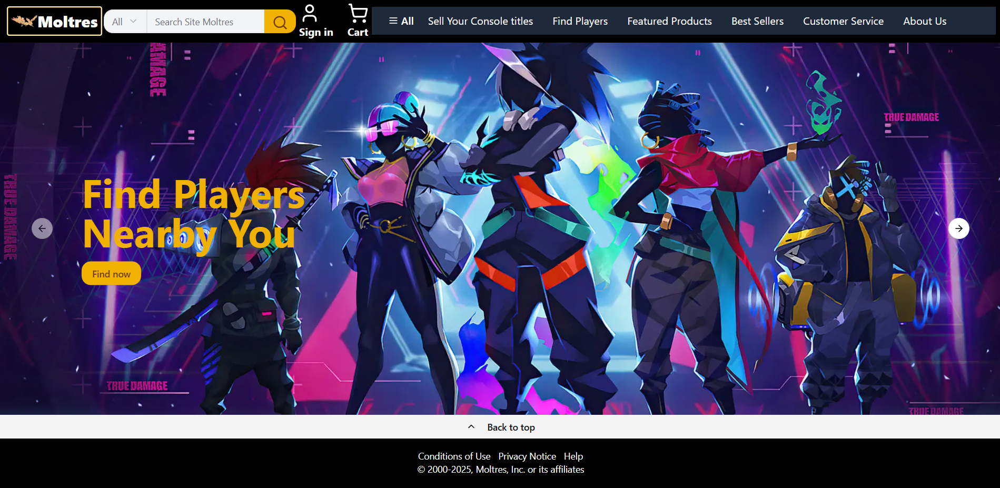

# 🎮 Moltres - Social Marketplace for Console Gamers

**Moltres** is a location-based application built with **Next.js**, **Node.js**, and **MongoDB**, allowing gamers to buy/sell pre-owned PlayStation and Xbox titles and connect with nearby players who share similar game interests.

---

## 🚀 Live Demo

[View the live site on Vercel](https://nextjs-mol-sameerkhan75s-projects.vercel.app/)

---

## 📸 Screenshot



> The main interface showcasing game listings, map-based discovery, and matchmaking features.

---

## 🚀 Features

* 🕹️ **Game Trading**: List and trade used PS/Xbox titles with other nearby gamers.
* 🗺️ **Map-Based Discovery**: Locate nearby sellers using integrated Map APIs and MongoDB geospatial queries.
* 🤝 **Team Matchmaking**: Automatically find and connect with players who enjoy the same games for teaming up.

---

## 🛠 Tech Stack

* **Frontend**: Next.js
* **Backend**: Node.js, Express.js
* **Database**: MongoDB + Mongoose
* **Maps**: Google Maps API / Mapbox
* **Styling**: TailwindCSS / CSS Modules
* **Hosting**: Vercel

---

## 📦 Getting Started

### 1. Clone the Repository

```bash
git clone https://github.com/sameerkhan75/nextjs-mol.git
cd nextjs-mol
```

### 2. Install Dependencies

```bash
npm install
```

### 3. Configure Environment Variables

Create a `.env.local` file:

```env
MONGODB_URI=your_mongodb_connection_string
MAP_API_KEY=your_map_api_key
```

### 4. Run Locally

```bash
npm run dev
```

App runs at: [http://localhost:3000](http://localhost:3000)

---

## 🧩 Future Enhancements

* In-app messaging between traders
* Push notifications for nearby listings
* Game wishlists and auto-matching

---

## 📄 License

MIT License

---

## 👨‍💻 Author

**Sameer Khan**
[GitHub](https://github.com/sameerkhan75)
Passionate about building social and utility-first products for gamers and making ideas to life and create more ideas 🎮
